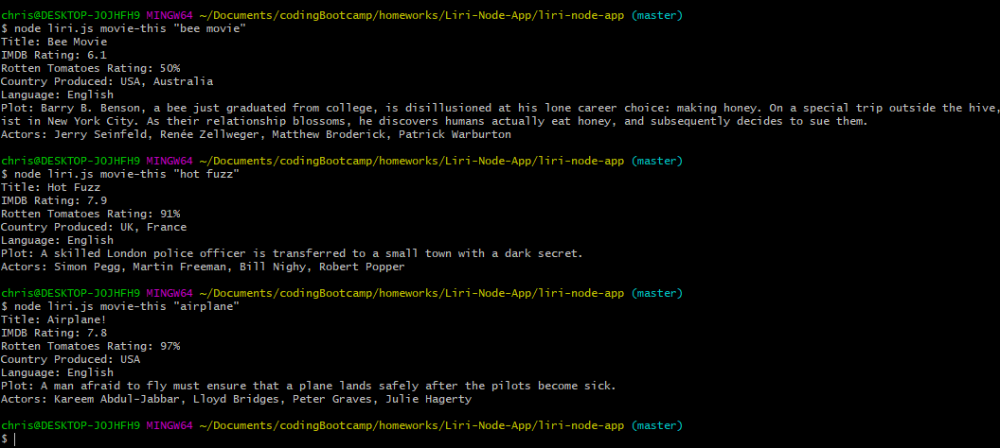
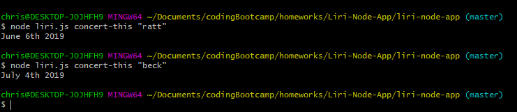

# -liri-node-app

Liri Bot
[Code @ GitHub](https://github.com/christophcannz/liri-node-app)

The Liri Bot will retrieve information about a requested song, concert, movie, as well as call a random command.
This application is built utilizing JavaScript and node.js. This application runs by entering commands into the computers terminal.

==OMDB==
within the terminal, and inside of the correct directory, you will enter; node liri.js movie-this "movie name" , press enter and the terminal will return information about the movie name entered.

==Bands in Town==
within the terminal, and inside of the correct directory, you will enter; node liri.js concert-this "band name" , press enter and the terminal will return information about the band name entered.

==Spotify==
within the terminal, and inside of the correct directory, you will enter; node liri.js spotify-this-song "song title" , press enter and the terminal will return information about the song title entered. This is not a functional feature at this time.
